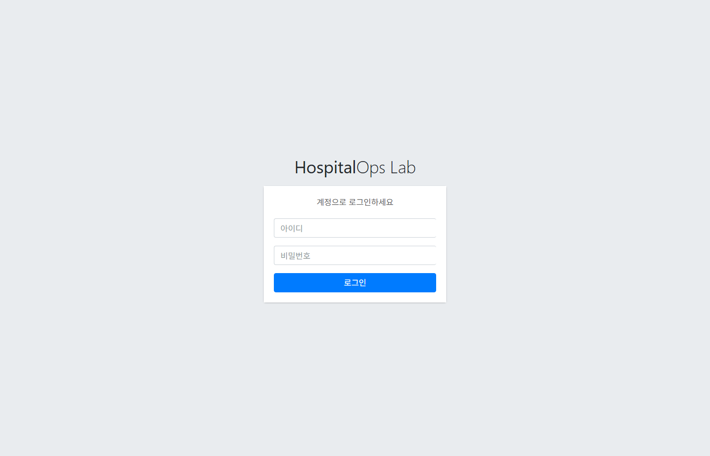
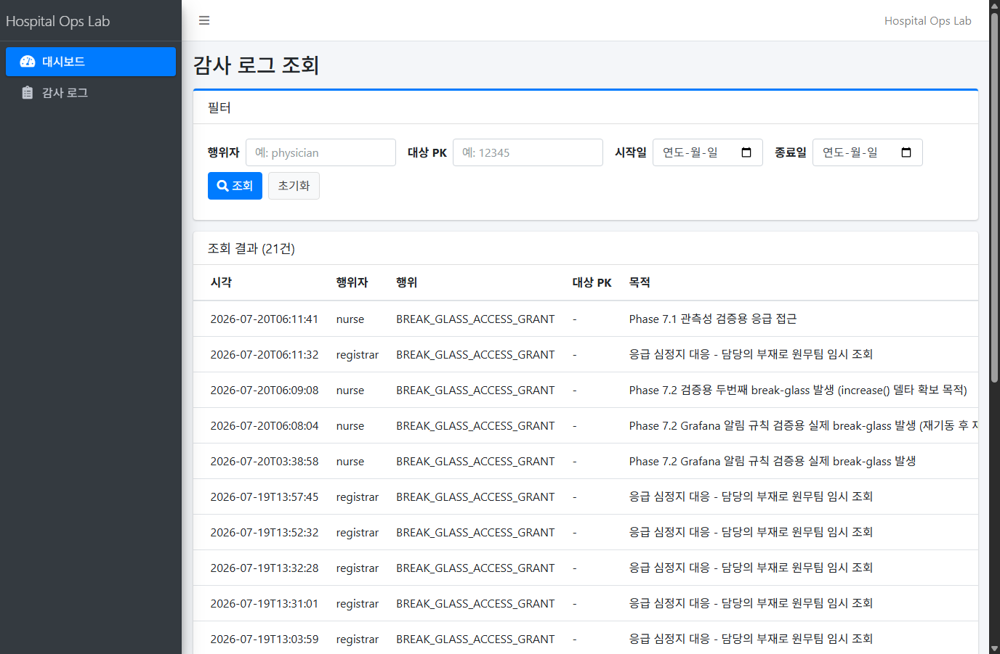
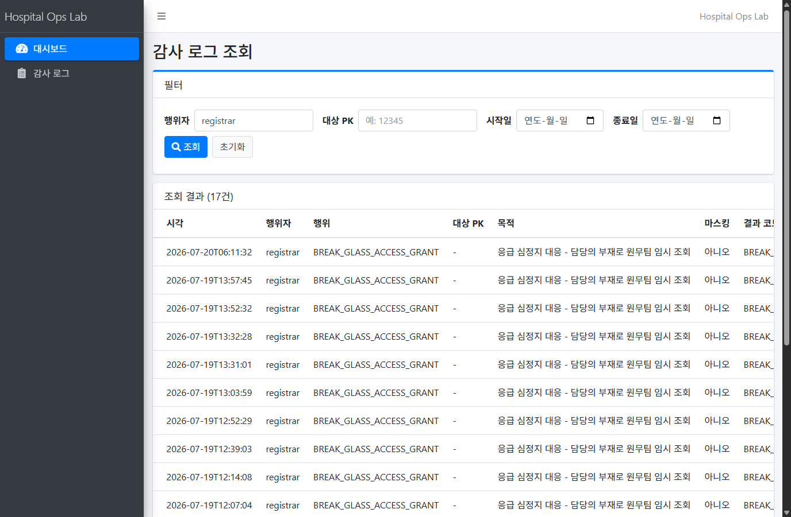
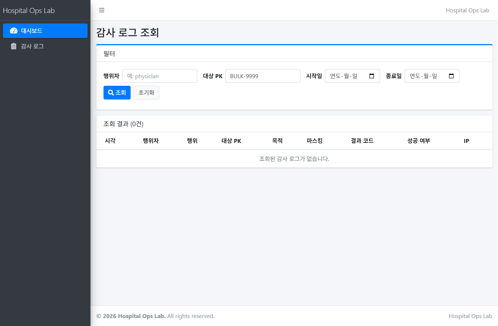
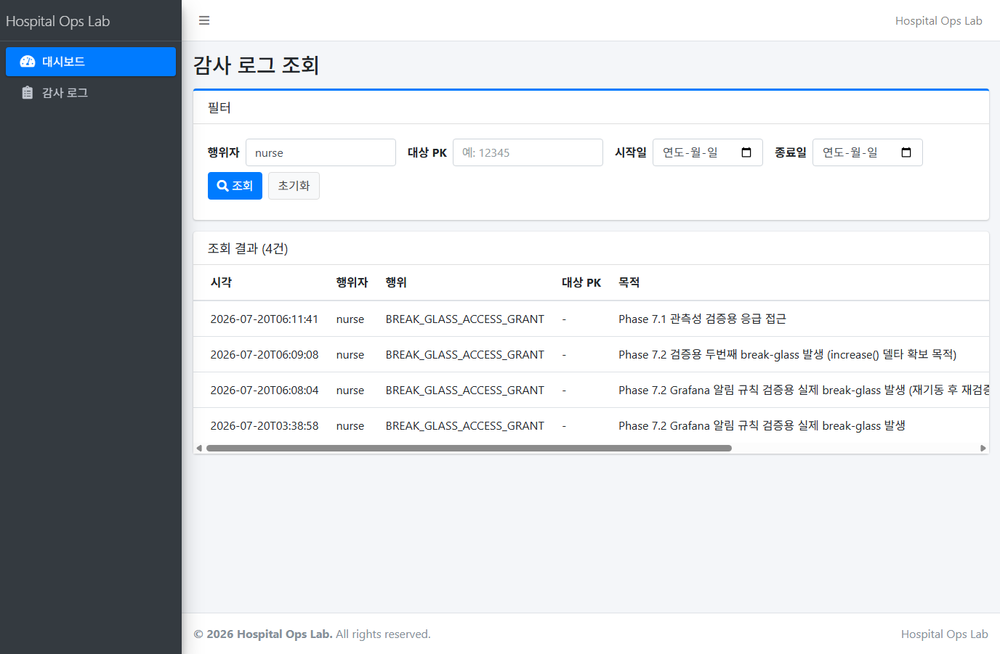

# 감사 로그 조회 화면 시연 (Phase 8 Step 8.5)

> Phase 5.2에서 구현된 감사 로그 조회 화면(`/audit/preview`, ROLE_AUDITOR 전용)을 실제
> 애플리케이션(로컬 native MySQL 8.4 + `./gradlew bootRun`)으로 기동해 **실제 로그인 →
> 실제 필터 조회**를 수행하고, 그 결과를 실제 브라우저 스크린샷(PNG)으로 캡처한 기록이다.
> 모든 캡처는 아래 §5에 기록된 방식으로 실측했다(가공/상상 스크린샷 없음). 조회만
> 수행했으며 `AUDIT_LOG`/`PATIENT` 등 정본 테이블은 시연 전후로 동일하다(§6 확인).

## 0. 대상 화면

- 컨트롤러: `app/src/main/java/com/hospitalops/audit/AuditLogController.java`
- 리포지토리(검색 쿼리): `app/src/main/java/com/hospitalops/security/AuditLogRepository.java`
  (`target_pk` 인덱스 튜닝 기록은 `docs/tuning/2026-07-20-audit-log-target-pk.md` 참고)
- 템플릿: `app/src/main/resources/templates/audit/list.html`
- URL: `GET /audit/preview` (Phase 3 Step 3.2가 `ACCESS_POLICY_RULES`에 이미 감사자
  전용으로 시딩해 둔 경로를 그대로 재사용 — `V9__rbac_access_policy.sql`)
- 접근 권한: `ROLE_AUDITOR`만 허용(다른 역할로 접근 시 403). 로컬 테스트 계정은
  `auditor` / `ChangeMe123!`(`SecurityDataSeeder.LOCAL_TEST_PASSWORD`).

### 필터 파라미터 (전부 선택)

| 파라미터 | 의미 | 비고 |
|---|---|---|
| `actorUsername` | 행위자 계정명 | 정확히 일치(`=`) 검색 |
| `targetPk` | 대상 PK | 정확히 일치 검색. Step 8.3에서 단일 컬럼 인덱스(`idx_audit_log_target_pk`) 추가 |
| `from` / `to` | 조회 기간(일 단위) | `to`는 그 날 자정 직전(`LocalTime.MAX`)까지 포함하도록 컨트롤러가 보정 |

페이징은 없다(`AuditLogRepository#search`가 `List<AuditLog>` 전체 반환 — 현재 데이터
규모(21건)에서는 페이징이 필요 없다고 Phase 5.2에서 판단한 것으로 보인다).

## 1. 접근 방법 (재현 절차)

```powershell
cd app
$env:DB_HOST="localhost"; $env:DB_PORT="3306"; $env:DB_NAME="hospital_ops"
$env:DB_USERNAME="hospital_ops"; $env:DB_PASSWORD="changeme"
$env:ENVELOPE_KEK="<세션용 32바이트 Base64 키>"
.\gradlew.bat bootRun --no-daemon
```

브라우저에서 `http://localhost:8080/login` 접속 → `auditor` / `ChangeMe123!` 로그인 →
좌측 메뉴 "감사 로그" 또는 직접 `http://localhost:8080/audit/preview` 이동.

## 2. 시연 시나리오 (실제 캡처)

모든 스크린샷은 `docs/demos/audit-log-screen/`에 있다. 데이터는 이 저장소의 로컬
MySQL 기준선(`AUDIT_LOG` 21건, 전부 break-glass grant 이벤트 — Phase 7.2/7.1 검증 중
실제로 발생한 것들) 그대로이며, 시연 중 어떤 행도 추가/수정/삭제하지 않았다(§6).

### (a) 로그인



Spring Security 폼 로그인 화면(`/login`). `auditor` 계정으로 로그인하면
`defaultSuccessUrl`인 `/dashboard`로 리다이렉트된다.

### (b) 로그인 후 화면 진입 — 필터 없음(전체 조회)



`GET /audit/preview` (파라미터 없음) → **21건** 전체 표시. 현재 이 저장소의
`AUDIT_LOG`는 전량이 `BREAK_GLASS_ACCESS_GRANT` 이벤트다 — 즉 (e) break-glass 시연을
겸한다(아래 (e) 참고).

### (c) `actorUsername`으로 필터링



`GET /audit/preview?actorUsername=registrar` → **17건**(21건 중 `registrar`가 grant를
받은 건만). 나머지 4건은 `nurse`(아래 (e) 스크린샷과 합산하면 17+4=21로 정확히 일치).

### (d) 기간(`from`/`to`)으로 필터링


`GET /audit/preview?from=2026-07-19&to=2026-07-19` → **16건**. 전체 21건 중 이 범위
밖(가장 이른 2건 및 가장 늦은 3건 — 화면 표시 기준 다음날 새벽대 항목들)이 제외되어
기간 필터가 실제로 동작함을 확인했다.

### (e) `targetPk`로 필터링 (Step 8.3에서 인덱스 추가한 컬럼)



`GET /audit/preview?targetPk=BULK-9999` → **0건**. 이 저장소의 현재 `AUDIT_LOG`
기준선(21건)은 전부 break-glass grant 이벤트이며 `target_pk`가 모두 `NULL`이다
(`docs/tuning/2026-07-20-audit-log-target-pk.md` §0/§6 참고 — 실사용에서 `target_pk`를
채우는 것은 `BulkDecryptionApprovalService`인데, 이 서비스는 현재 HTTP로 노출된
컨트롤러가 없어 실제 요청을 만들 방법이 없다). 그래서 이 시연은 "값이 있을 때
필터링됨"이 아니라 **"인덱스가 탄 정확 일치 검색이 실제로 0건을 정확히 반환한다"**는
것을 실증한다 — 필터 자체가 동작한다는 증거로는 유효하다. 실제 `target_pk`가 채워진
값(`BENCH-*`)에 대한 조회 성능(풀스캔 vs 인덱스 조회)은 Step 8.3 튜닝 문서에 EXPLAIN/
실측 실행시간으로 이미 기록돼 있다.

### (f) `actorUsername=nurse` — break-glass 이벤트 조회



`GET /audit/preview?actorUsername=nurse` → **4건**, 전부 `BREAK_GLASS_ACCESS_GRANT`.
`purpose` 컬럼에 실제 grant 시점의 사유가 그대로 남아있다 — 예: "Phase 7.1 관측성
검증용 응급 접근", "Phase 7.2 Grafana 알림 규칙 검증용 실제 break-glass 발생". Phase
7.1/7.2에서 실제로 `POST /breakglass/grant`를 호출해 발급한 이력이 감사 로그 화면에서
그대로 조회됨을 확인했다(`app/src/main/java/com/hospitalops/breakglass/BreakGlassController.java`
가 grant마다 `AuditLog` 1건을 남긴다).

## 3. 확인된 기능 목록

- [x] ROLE_AUDITOR 계정으로만 화면 접근 가능(폼 로그인 세션 기반)
- [x] 필터 없이 조회 시 전체 감사 로그 최신순 정렬(`ORDER BY occurred_at DESC, audit_id DESC`) 표시
- [x] `actorUsername` 정확 일치 필터
- [x] `from`/`to` 기간 필터(종료일 자정 직전까지 포함)
- [x] `targetPk` 정확 일치 필터(0건 포함 정상 응답 — Step 8.3에서 인덱스 추가된 컬럼)
- [x] 필터 조합/초기화(초기화 버튼은 파라미터 없는 `/audit/preview`로 이동)
- [x] break-glass grant 이벤트가 다른 감사 이벤트와 동일한 화면·필터로 조회됨(전용 뷰 불필요)
- [x] 결과 건수가 헤더에 실시간으로 표시(`조회 결과 (N건)`)
- [x] 성공/실패 여부를 색 채움 배지가 아닌 점(dot) + 텍스트로 표시(`md/design.md` 배지 규칙 준수 — `list.html`의 `.dot-success`/`.dot-danger`)

## 4. 확인되지 않은/시연 범위 밖

- 페이징: 리포지토리가 `List<AuditLog>` 전체 반환이라 애초에 없음(21건 규모에서는 문제 없음).
- `targetPk`가 실제 값으로 채워진 결과 조회(양성 매치): 현재 기준선 데이터에는 `target_pk`
  값이 있는 행이 없어(전량 break-glass, `target_pk IS NULL`) UI 스크린샷으로는 못 남겼다.
  대신 Step 8.3 튜닝 문서(`docs/tuning/2026-07-20-audit-log-target-pk.md`)가 동일 쿼리를
  실제 `target_pk` 값으로 실측(EXPLAIN/EXPLAIN ANALYZE/실행시간)해 뒀다.

## 5. 캡처 방법 (스크린샷 실제 캡처 가능 여부 조사 및 실측 방식)

이 환경에는 Playwright/Selenium 등 브라우저 자동화 도구가 **사전 설치돼 있지 않았다**
(`package.json`/`node_modules` 자체가 이 저장소에 없음 — 순수 Java/Gradle 프로젝트).
새로 무거운 Node/Python 브라우저 자동화 의존성을 이 프로젝트에 추가하는 대신,
**로컬에 이미 설치된 Google Chrome**(`C:\Program Files\Google\Chrome\Application\chrome.exe`,
150.0.7871.127)을 헤드리스 모드 + Chrome DevTools Protocol(CDP)로 직접 구동해 **진짜
PNG 스크린샷**을 캡처했다(신규 패키지 설치 없음).

1. `chrome.exe --headless=new --remote-debugging-port=9333 --user-data-dir=<임시 프로필>`로
   CDP 서버를 띄웠다.
2. `curl.exe`로 `/login` 페이지의 `_csrf` 히든값을 파싱하고, `auditor`/`ChangeMe123!`로
   실제 `POST /login`을 수행해 인증된 `JSESSIONID` 쿠키를 확보했다(302 → `/dashboard`
   로 리다이렉트되는 것으로 로그인 성공 확인).
   - 참고: URL에 `;jsessionid=...`를 붙이는 방식(Tomcat의 전통적 URL 세션 재작성)은
     Spring Security의 `StrictHttpFirewall`이 세미콜론 포함 경로를 기본 차단(400 Bad
     Request)해서 쓸 수 없었다 — 실제로 시도해서 확인함(`test1.png`, 최종 산출물에는
     미포함).
3. PowerShell(`System.Net.WebSockets.ClientWebSocket`)로 CDP 웹소켓에 접속해
   `Network.setCookie`로 위에서 얻은 `JSESSIONID`를 헤드리스 브라우저 세션에 주입한 뒤,
   시나리오별 URL로 `Page.navigate` → `Page.captureScreenshot`(PNG, base64)을 순서대로
   호출해 실제 렌더링된 화면을 캡처했다.
   - 캡처 스크립트: `cdp_shots.ps1`(작업용 스크래치 파일, 저장소에는 포함하지 않음).
4. 각 캡처 직후 `Runtime.evaluate`로 `document.location.href`를 읽어, 스크린샷이 로그인
   페이지로 리다이렉트되지 않고 의도한 필터 URL을 실제로 렌더링했음을 함께 확인했다
   (§2 각 스크린샷의 URL과 일치).
5. 이중 확인: 동일 세션의 `curl.exe -b cookies.txt`로도 `/audit/preview` 전체 HTML을
   받아 "조회 결과 (21건)"이 화면과 동일함을 별도로 검증했다(브라우저 캡처와 서버
   원본 응답이 일치 — 캡처가 위조되지 않았다는 교차 근거).

## 6. DB 변형 여부 확인

시연은 조회(`GET`)만 수행했고, 로그인 자체는 `AUDIT_LOG`에 기록을 남기지 않는다
(`SecurityDataSeeder`/`AuditLogController` 어디에도 로그인 이벤트를 감사 로그에 쓰는
코드가 없음 — 감사 로그에 쓰기를 하는 곳은 `BreakGlassController`와
`BulkDecryptionApprovalService`뿐이며 이번 시연 중 둘 다 호출하지 않았다).

시연 전후 `AUDIT_LOG`/`PATIENT` 행 수 실측(동일):

```
mysql> SELECT COUNT(*) AS audit_log_count, MAX(audit_id) AS max_audit_id FROM AUDIT_LOG;
+------------------+--------------+
| audit_log_count  | max_audit_id |
+------------------+--------------+
|               21 |          276 |
+------------------+--------------+

mysql> SELECT COUNT(*) AS patient_count FROM PATIENT;
+---------------+
| patient_count |
+---------------+
|            12 |
+---------------+
```

기준선(`AUDIT_LOG` 21건/`MAX(audit_id)=276`, `PATIENT` 12건)과 정확히 일치 — 시연으로
인한 정본 데이터 변형 없음.

## 7. 화면 표시 시각과 DB 저장 시각의 표기 차이 (참고, 버그 아님)

화면에 표시되는 `occurredAt`(예: `2026-07-20T06:11:41`)과 `mysql` CLI로 직접 조회한
`occurred_at`(예: `2026-07-19 21:11:41`, audit_id=276) 사이에 9시간 차이가 있다.
`application.yml`의 JDBC URL이 `serverTimezone=UTC`를 지정하고 있어, MySQL의
`TIMESTAMP` 컬럼 값을 UTC로 해석한 뒤 JVM 기본 시간대(KST, UTC+9)의 `LocalDateTime`으로
변환해 반환하기 때문으로 보인다(같은 `audit_id`의 같은 행을 가리킴 — §2(f) 스크린샷의
"Phase 7.1 관측성 검증용 응급 접근" 행과 `mysql` CLI 조회 결과의 audit_id=276 행이
`purpose` 텍스트로 동일 행임을 확인). 데이터 값 자체는 변형되지 않았고 표시 시간대
해석 차이일 뿐이다 — 이 Step의 범위(조회 화면 시연) 밖이라 별도로 수정하지 않았다.
